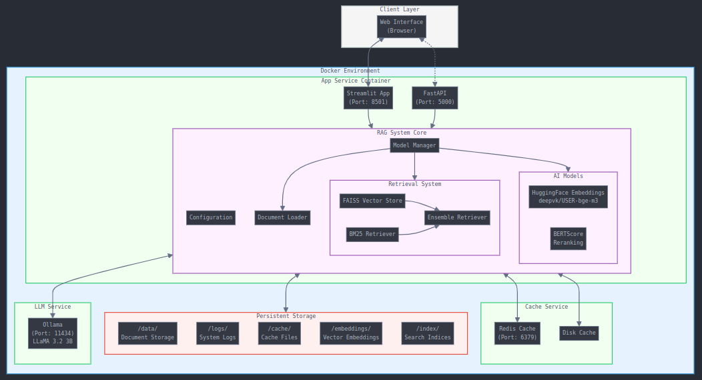

<<<<<<< HEAD
# Library_search_2024
Международный Хакатон: Информационно-Поисковая Система для Библиотеки Агентства Media Wise
=======

# Международный Хакатон: Информационно-Поисковая Система для Библиотеки Агентства Media Wise
https://hacks-ai.ru/events/1077382

*Решение команды:*  🏆 `DataSherlocks`

```AMAT VICTORIA CURAM```

### 👷⚙️🌳 Архитектура проекта


### 📚 Описание задачи
Участникам предлагается разработать чат-бота с веб-интерфейсом, который будет быстро находить релевантную информацию в библиотеке материалов агентства, включающей текстовые и презентационные файлы. Система должна предоставлять ссылки на искомую информацию, а также позволять добавлять новые файлы в базу данных.

Этот репозиторий содержит скрипт для системы поиска информации и ответа на вопросы, использующий передовые методы машинного обучения и обработки естественного языка. Система применяет гибридный подход, комбинируя традиционные методы, такие как BM25, и современные методы на основе эмбеддингов для повышения точности поиска и генерации ответов.

### 🔧 Основные возможности
- **Поиск документов**: Использует комбинацию BM25 и FAISS для релевантного поиска документов.
- **Разделение текста**: Разбивает большие документы на меньшие части для оптимальной обработки.
- **Поиск на основе эмбеддингов**: Улучшает точность поиска за счёт использования эмбеддингов из моделей HuggingFace.
- **Оценка релевантности**: Применяет BERT для оценки релевантности найденных документов.
- **Генерация ответов**: Генерирует ответы на основе контекста, используя языковую модель.
- **Логирование**: Внедрено с помощью loguru для удобной отладки и анализа.
- **Кэширование**: Используется diskcache для повышения производительности.

### 🥁 Установка
1. Клонируйте репозиторий:
   ```bash
   git clone <repository_url>
   cd <repository_name>
   ```
   ```bash
   # можно так
   chmod +x launch.sh
   ./launch.sh
   ```
   ```bash
   # можно вот так...
   # Docker Compose конфигурация включает три сервиса: основное приложение с Python и Streamlit (порты 8501 и 5000), 
   # сервис Ollama для работы с LLM-моделью (порт 11434) и опциональный Redis для кэширования (порт 6379), 
   # с настроенными томами для хранения данных и ограничениями по памяти для каждого сервиса.

   mkdir -p data logs cache models embeddings index
   docker-compose up -d
   docker exec datasherlocks-ollama ollama pull llama3.2:3b-instruct-fp16   # API на порту 11434
   ```
2. Установите Python 3.11 и зависимости:
   ```bash
   sudo add-apt-repository ppa:deadsnakes/ppa
   sudo apt update
   sudo apt install python3.11 python3.11-venv
   python3.11 -m venv myenv
   source myenv/bin/activate
   pip install -r requirements.txt
   ```
3. Установите Ollama для работы с LLaMA:
   ```bash
   curl -fsSL https://ollama.com/install.sh | sh
   ollama pull llama3.2:3b-instruct-fp16
   ollama list  # проверить что все установлено
   ```

### 🏃‍♂️ Запуск
- **Основной код**: `python main.py`
- **Чат-бота с веб-интерфейсом**: `python app_chart.py`
- **Сервер**:
  ```bash
  uvicorn app:app --host 0.0.0.0 --port 5000
  # или
  python app.py

  # сначала прибить процессы pkill gunicorn
  gunicorn -D -w 6 -t 8 -k uvicorn.workers.UvicornWorker app:app --bind 0.0.0.0:5000 --timeout 0 --reload
  ```

### 🏗️ Структура кода
- **Config**: Управление конфигурацией.
- **RAGSystem**: Основная функциональность поиска и генерации ответов.
- **Вспомогательные функции**: Упрощают обработку текста и оценку релевантности.

- **папка CI_CD** - файлы для настройки CI/CD
- **файл main_exp.py** - Экспериментальный файл, в котором проводится попытка учесть временные характеристики создания документа и повысить релевантность найденного чанка в ТОП_5.

### 🏆 Преимущества
- **Гибридный поиск**: Совмещает BM25 и эмбеддинги для точного поиска.
- **Эффективность**: Поддержка многопоточности и кэширования для ускорения.
- **Гибкость**: Поддержка CPU и GPU, автоматическое обновление базы данных.
- **Надёжное логирование**: Подробные логи для мониторинга и отладки.

### 📌 Требования к ресурсам
Модель эффективно работает как на CPU, так и на GPU. Однако для обработки больших объёмов данных рекомендуется наличие видеокарты, что значительно ускоряет работу.

### 🥁 Резюме
Скрипт представляет собой мощное решение для информационно-поисковых задач с поддержкой гибридного поиска и генерации ответов на основе контекста, подходящее для широкого круга приложений.


>>>>>>> e70ca78 (📌 Initial commit)
